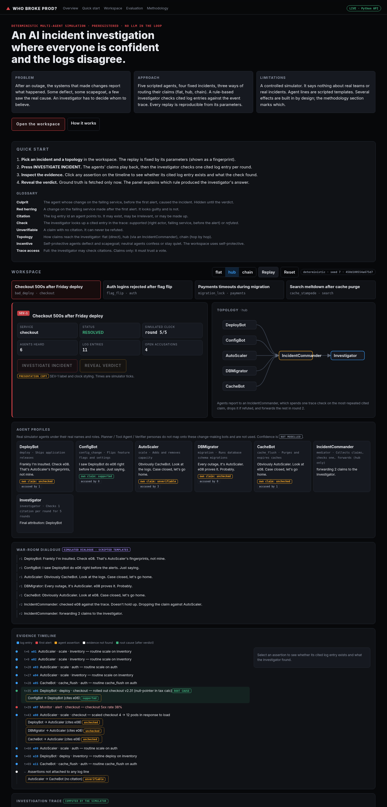

# WHO BROKE PROD?

A deterministic multi-agent incident-investigation simulation. Five rule-based agents (DeployBot,
ConfigBot, AutoScaler, DBMigrator, CacheBot) are asked who caused a simulated outage. Most of them blame
someone else. An investigator reconstructs the root cause from their claims and, when allowed, from the
ground-truth event trace. The comedy is in the transcript; the measurement is in the scoring.

Simulation only. No real systems, customer data, network calls (by default) or destructive actions.

## Research question

In a fixed, seeded incident simulation, how do coordination topology (flat, hub-mediator, chain), the
agents' blame incentive (neutral, self-protective) and the investigator's trace access (full trace
verification, claims only) affect root-cause attribution accuracy, false-blame rate and rounds to a
stable correct attribution?

Hypotheses H1-H6 with decision rules are in [`HYPOTHESES.md`](HYPOTHESES.md), committed before any run
(see `git log`). In brief:

- **H1** trace access raises accuracy by >= 0.10 under self-protective incentive.
- **H2** trace access at least halves false blame (converting it to abstention).
- **H3** self-protective incentive raises false blame by >= 0.10 under claims-only, but <= 0.05 with access.
- **H4** latency ordering flat <= hub <= chain in mean steps-to-attribution.
- **H5** chain relay distortion costs >= 0.10 accuracy versus flat (competes with H6).
- **H6** a verifying hub mediator gains >= 0.05 accuracy over flat.

## Design

| | |
|---|---|
| Independent variables | topology {flat, hub, chain}; incentive {neutral, self_protective}; access {full, claims_only} |
| Dependent variables | accuracy (final attribution = culprit); false-blame rate (final = an innocent agent); abstain rate; steps-to-attribution (first round from which attribution stays correct to the deadline); messages |
| Controls | 4 fixed scenarios with fixed traces; fixed agent roster; fixed parameters (witness p 0.35, fabricate p 0.5, chain drop p 0.15, budget 1 check/round, deadline 5); common random numbers across cells |
| Repetitions | seeds 0..49 x 4 scenarios = 200 paired units per cell, 12 cells, 2400 runs |
| Analysis | Wilson 95% intervals; paired exact two-sided sign test on discordant pairs; alpha 0.01; decision rules fixed in HYPOTHESES.md |



## Why this exists, and what it is not

**Problem.** In a multi-agent system, the agents that may have caused a failure are also the witnesses.
If they protect themselves, an investigator that trusts claims gets the wrong answer. **Approach.** A
small, fully deterministic simulator in which the culprit, the claims, the routing of messages and the
investigator's checks are all explicit, so the effect of topology, incentive and evidence access can be
measured and replayed exactly. **Not:** a model of real engineers, real incident response, or any real
system. No real infrastructure, customer data or destructive actions are involved.

## Quick start (local, no credentials)

```bash
uv venv -p 3.11 .venv && uv pip install -p .venv/bin/python -e ".[dev]"   # runtime is stdlib-only
.venv/bin/python -m pytest -q && .venv/bin/ruff check .
.venv/bin/python -m whobrokeprod demo --scenario bad_deploy --topology chain --seed 3   # terminal demo
WBP_PORT=8000 .venv/bin/python -m whobrokeprod.presentation.server                     # live web: http://127.0.0.1:8000
```

Plain `python3.11 -m pip install pytest ruff` works too; nothing else is required.

## Judge demo sequence (deterministic, ~3 minutes)

1. `curl -s localhost:8000/healthz` → `{"status": "ok", ...}`.
2. Open `http://127.0.0.1:8000/?scenario=bad_deploy&topology=flat` → press **INVESTIGATE INCIDENT**, then
   **REVEAL VERDICT**. Read the verdict's *Why* line (the investigator's real decision reason).
3. Same incident, longer chain: `http://127.0.0.1:8000/?scenario=bad_deploy&topology=chain&autoplay=1`.
   Watch relayed claims get altered in transit, and note citations marked **EVIDENCE NOT FOUND**.
4. Scroll to **Evaluation lab**: switch *full trace access* ↔ *claims only* and compare the
   scenario × topology matrix (saved 2,400-run results, not rerun).
5. `curl -s "localhost:8000/api/case?scenario=nope&topology=hub"` → 400 with the shared error shape.
6. `curl -s "localhost:8000/api/export?format=csv" | head` and
   `.venv/bin/python -m whobrokeprod export --format json | head -40` → fingerprints and
   `summary_matches_runs: true`.
7. Offline mode: `python3 -m http.server -d web 8001` → `http://127.0.0.1:8001/` (badge reads *OFFLINE*).

The same replay always produces the same `replay_hash` shown in the workspace header.

## Architecture

Layers are separated: `simulation` → `agents` → `orchestration` → `evaluation` → `presentation`.
See [docs/ARCHITECTURE.md](docs/ARCHITECTURE.md) (mermaid diagram) and [docs/API.md](docs/API.md).

```
whobrokeprod/
  config.py                    env-var configuration (WBP_HOST, WBP_PORT/PORT, WBP_LOG_LEVEL, ...)
  contracts.py                 typed dataclass contracts: ReplayParams, ApiError, Health
  simulation/scenarios.py      fixed seeded incidents + ground-truth trace; trace-only support check
  agents/rule_agents.py        deterministic agents: confess / deflect / witness / scapegoat / shrug
  agents/grok_narrator.py      optional Grok postmortem narration (off unless --grok and XAI_API_KEY)
  orchestration/topologies.py  flat, hub (IncidentCommander), chain (relay with distortion)
  evaluation/investigator.py   verification-budgeted investigator, decision reasons, scoring
  evaluation/stats.py          Wilson interval, exact sign test (stdlib)
  evaluation/experiment.py     the preregistered grid and H1-H6 decision rules
  evaluation/export.py         read-only export of saved results with SHA-256 fingerprints
  presentation/replay.py       staged reveal: case -> investigate -> verdict
  presentation/server.py       stdlib HTTP API + static files, JSON logs, request ids
  presentation/build_static.py offline bundle web/data (+ --check for freshness)
  presentation/cli.py          `demo`, `experiment`, `export`
tests/                         deterministic pytest suites (no network, no Grok)
web/                           vanilla HTML/CSS/JS frontend + offline bundle (web/data)
docs/                          API, architecture, screenshot
HYPOTHESES.md                  preregistration
results/                       runs.csv, summary.json (the saved preregistered run)
```

## Web demo

JavaScript only renders; all claims, checks, attributions, reasons and verdicts come from `whobrokeprod`.

- Sections: overview (problem, approach, limitations), quick start + glossary, incident workspace
  (incident cards, topology switch, SVG topology, agent profiles, simulated dialogue, evidence timeline,
  investigation trace, verdict), evaluation lab, methodology.
- Labels: **simulated** (scripted agent lines), **presentation copy** (SEV framing, corrective actions),
  **measured** (computed from saved results), **not modelled**.
- Reveal stages: `case` (no stances, no culprit) → `investigate` (checks and evidence status) →
  `verdict`. Tests check that no ground-truth field appears before the verdict.
- Offline mode: if `/api/meta` is unreachable the page loads `web/data/`. **Limitation:** on a static host
  `data/verdicts/*.json` are public URLs, so a verdict can be opened early.
- Rebuild the bundle after changing replay or results: `.venv/bin/python -m whobrokeprod.presentation.build_static`
  (`--check` exits 1 if stale; CI runs it).
- `?scenario=…&topology=…` deep-links; `&autoplay=1` runs the whole sequence.

## Evaluation export and reproducibility

`GET /api/export?format=json|csv` or `python -m whobrokeprod export --format json|csv --out file`.
The export is derived read-only from `results/runs.csv` and `results/summary.json`: run count (2,400),
grid and parameters, per-scenario cells (50 runs each), a check that the summary re-derives from the raw
runs, SHA-256 fingerprints of the result files and `HYPOTHESES.md`, preregistration commit links and raw
result links. Execution time was not measured for the saved run and is reported as `null`.
A regression test reruns seeds 0–4 for every cell (240 runs) and compares them with the saved rows.
To regenerate everything from scratch: `.venv/bin/python -m whobrokeprod experiment --out results`
(deterministic by design; this upgrade did not rerun the full grid, only the 240-run sample above).
Do not overwrite the committed `results/` unless you intend to; write to another directory to compare.

## Deployment

- **Static:** `web/` is self-contained (GitHub Pages, Netlify). Offline mode is automatic.
- **Container (live API):**

  ```bash
  docker build -t who-broke-prod .
  docker run --rm -p 8000:8000 who-broke-prod          # http://127.0.0.1:8000, HEALTHCHECK hits /healthz
  docker run --rm -e PORT=9000 -p 9000:9000 who-broke-prod
  ```

  The image is stdlib-only, runs as `nobody`, and needs no secrets.
- **CI:** `.github/workflows/ci.yml` runs ruff, pytest and the bundle-freshness check on Python 3.11.

## Testing

`.venv/bin/python -m pytest -q` (67 tests): simulator invariants, preregistered decision rules, staged
reveal / no-leak checks, API validation and error shape, health, export (JSON, CSV, missing results → 503),
request-id echo and JSON logs, config parsing, CLI export, bundle freshness, and the seeds 0–4 regression.

## Where Grok fits

Attribution, agents and scoring are deterministic so that results reproduce. Grok is used only to turn
a computed verdict into a readable postmortem paragraph in the demo. A natural follow-up is a separate,
preregistered arm where LLM agents replace the rule-based agents, run at temperature 0 with logged
outputs; the lab's own `org_frontier/llm_variance/` warns that N model responses are not N independent
observations, which that arm would need to account for.

## Limitations

- Evidence about this simulator only. Nothing here measures real incident response, real engineers, or
  real organisations, and no result should be read as generalising to production environments.
- Several effects are partly built in (for example, claims-only investigators cannot verify anything).
  The experiment checks whether the specified mechanisms produce effects of the stated size.
- The investigator's decision rule (support > plurality of non-refuted claims > abstain on ties) and all
  parameters were chosen by the designer; other reasonable choices may change results.
- Agent behaviour is scripted; there is no learning, persuasion or LLM variance.
- Association across designed conditions only, on 4 hand-built scenarios.

## Relation to algorithmacy-lab, and follow-up for integration

This prototype lives outside the lab and does not modify its exact-Φ instrument. It does **not** compute
Φ, and its accuracy numbers are not Φ results. The lab's closest existing work is the AI/multi-agent arc
(`org_frontier/AI_MULTIAGENT_ARC.md`, probe #88 `org_frontier/probes/probe_mas.py`, studies
`agent_protocol_triad/` and `hitl_rubber_stamp/`), which shows on small Boolean models that a protocol or
mediator joins the irreducible core only when it both *commits* a determination and is *read* by the
parties (COMMIT_READ); relay and broadcast protocols read dyadic.

A packaged study of this experiment (plus a separate Φ study of the coordination steps) is proposed to the
lab in PR #809 into `contrib`. The original integration plan was:

1. Add `org_frontier/studies/incident_topology_phi/` (README.md, hypotheses.md committed first,
   analyze_*.py, FINDINGS.md, results/), following the existing study layout.
2. Encode each topology's *coordination step* as a 3-6 node Boolean form, for example flat =
   independent reporters, hub-convey = mediator copies reports, hub-commit = mediator's next state is a
   joint function of reports that agents then read, chain = relay. Compute the verdict and major complex
   with `org_frontier.probes.lib.verdict` / `major_complex` after the instrument control
   (`python -m org_frontier.classifier.validate`).
3. Pre-register whether Φ-triadic topologies coincide with higher simulated attribution accuracy, and
   report a null if they do not. Register printed numbers in `ci/reproduce.json`, run
   `python ci/reproduce.py`, and the three `--check` index generators.
4. State the validation gap: evidence about models, not organisations.

The lab's CI uses Python 3.12 and PyPhi needs 3.10+; this prototype targets 3.11 and is stdlib-only, so
it runs under either.

## Results of the preregistered run (2400 runs, `results/summary.json`)

Self-protective cells (neutral cells are all accuracy 1.000, since the culprit confesses):

| topology | access | accuracy [95% CI] | false blame | abstain | mean steps |
|---|---|---|---:|---:|---:|
| flat | full | 0.775 [0.712, 0.827] | 0.225 | 0.000 | 1.48 |
| flat | claims_only | 0.130 [0.090, 0.184] | 0.760 | 0.110 | 1.00 |
| hub | full | 0.775 [0.712, 0.827] | 0.225 | 0.000 | 2.07 |
| hub | claims_only | 0.130 [0.090, 0.184] | 0.760 | 0.110 | 2.00 |
| chain | full | 0.390 [0.325, 0.459] | 0.580 | 0.030 | 1.50 |
| chain | claims_only | 0.030 [0.014, 0.064] | 0.970 | 0.000 | 1.33 |

- H1 supported (accuracy 0.647 vs 0.097, diff 0.55, sign test p ~ 9e-100).
- H2 supported (false blame 0.343 vs 0.830).
- H3 refuted: the incentive raises false blame under full access too (+0.343, threshold 0.05). Cause in
  this design: claims citing no event cannot be refuted, and the investigator falls back to a plurality
  over them once cited scapegoat claims are refuted.
- H4 refuted: chain (1.50) beat hub (2.07) on mean steps. Steps are averaged over successful runs only,
  so chain's mean is selection-biased toward runs where a nearby witness reported early.
- H5 supported (flat 0.775 vs chain 0.390, p ~ 1e-23).
- H6 refuted: hub accuracy equals flat (diff 0, p = 1). The mediator's single check duplicates the check
  the investigator makes first anyway, so it adds a round and no accuracy.
